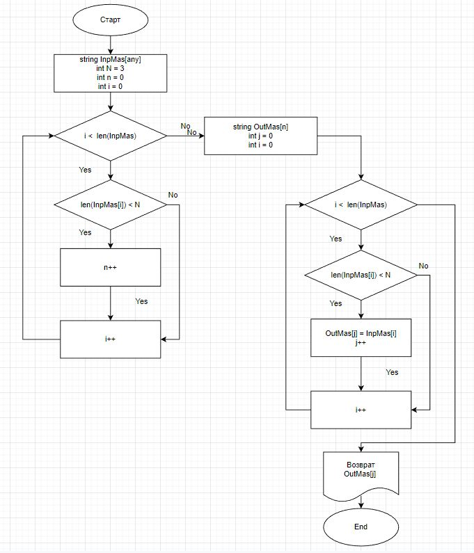

# Контрольная работа

## Условия задачи

*Написать программу которая из имеющегося массива из строк сформирует массив из строк, длина котрых менше 
либо равна 3 символа. Первоначальный массив можно ввести с клавиатуры, либо задать на старте выполнения 
алгоритма.*

## Блок схема основного метода

## Описание метода

* На вход метод ThreeMas получает входной массив InpMas и длину строки N больше которой элементы не войдут в новый массив.
* В первом цикле мы определяем размерность выходного массива n.
* Вторым циклом мы заполняем выходной массив OutMas по условию длины элемента с роки больше либо равного N